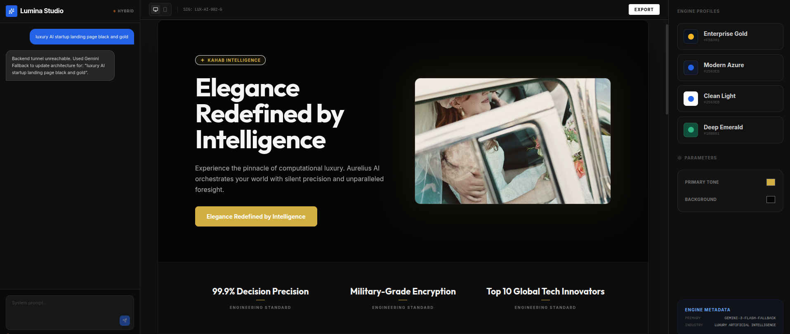

<div align="center">
  
</div>


# AI UI Generator (Gemini-powered)

An **AI-powered full-stack application** that generates **complete landing page UI specifications** using Google Gemini.  
The backend analyzes a user prompt and returns structured JSON, while the frontend consumes and renders the generated UI.

---

## ✨ Key Features

- AI-based intent understanding (industry, tone, theme)
- Automatic landing page planning
- Premium AI-generated marketing copy
- Dark / Light theme generation
- Modular UI sections (hero, services, workflow, CTA, etc.)
- FastAPI backend
- Frontend UI renderer (included in this repository)
- JSON-first, frontend-agnostic architecture

---

## 🧠 System Overview

1. User enters a prompt in the frontend
2. Frontend sends request to FastAPI backend
3. Backend uses Gemini to:
   - Detect intent
   - Plan page sections
   - Generate copy
   - Apply theming
4. Backend returns structured JSON
5. Frontend renders the UI dynamically

---

## 🏗️ Tech Stack

### Backend
- Python 3.10+
- FastAPI
- Pydantic
- Google Gemini API
- Requests
- CORS Middleware

### Frontend
- Included in this repository
- Consumes JSON response from backend
- Renders dynamic UI sections

---

## 📁 Project Structure

```text
.
├── backend/
│   └── app.py
├── frontend/
│   ├── src/
│   └── index.html
├── banner.png
├── README.md
└── requirements.txt


## Run Locally

**Prerequisites:**  Node.js


1. Install dependencies:
   `npm install`
2. Set the `GEMINI_API_KEY` in [.env.local](.env.local) to your Gemini API key
3. Run the app:
   `npm run dev`
# Ai-UI-Generator
